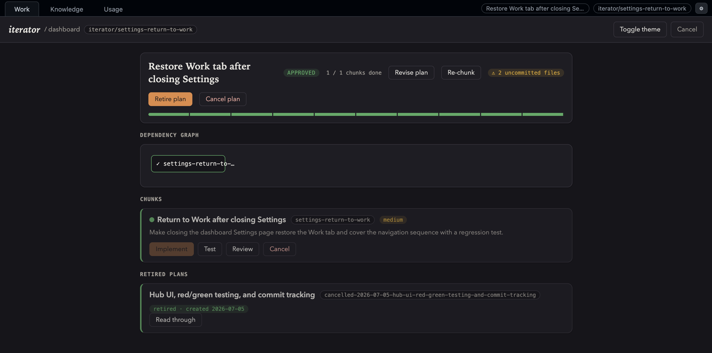
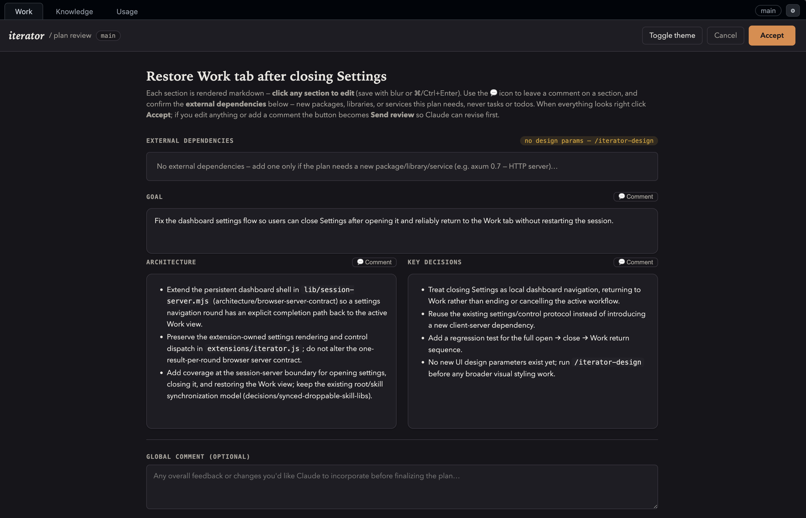
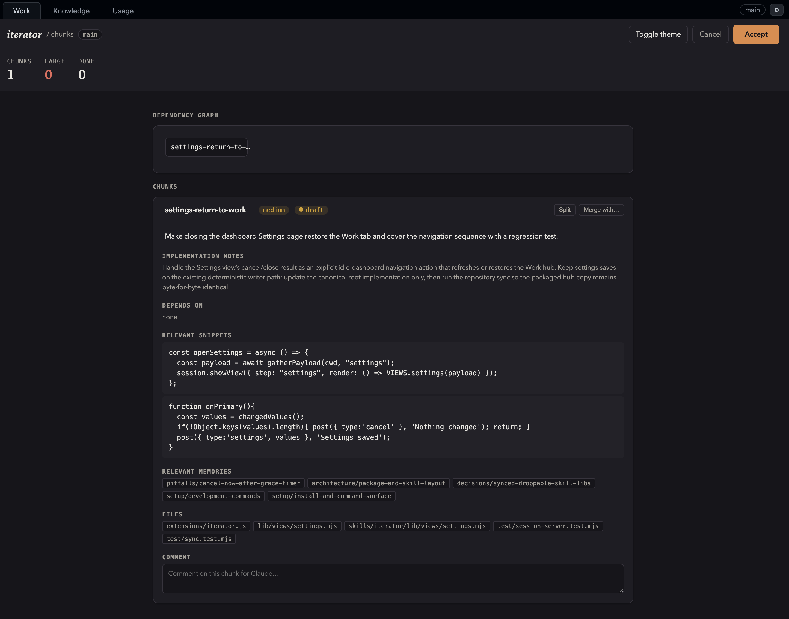
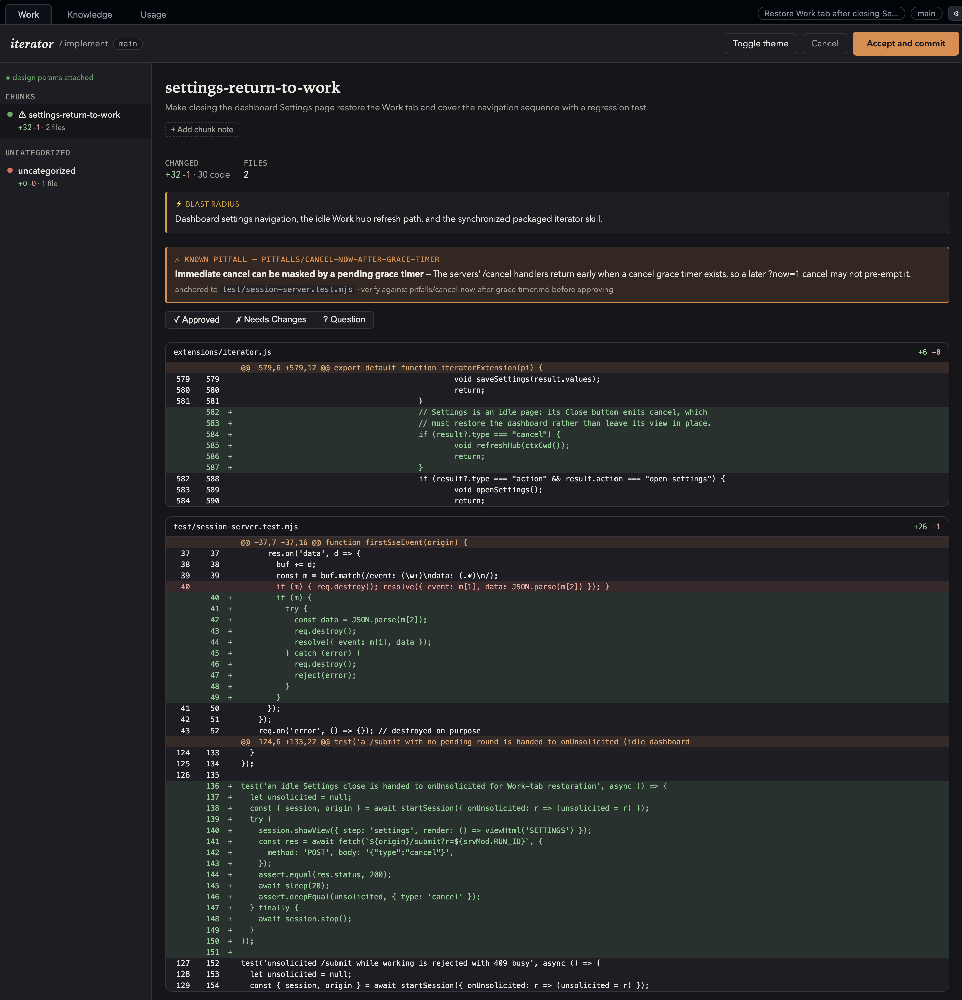
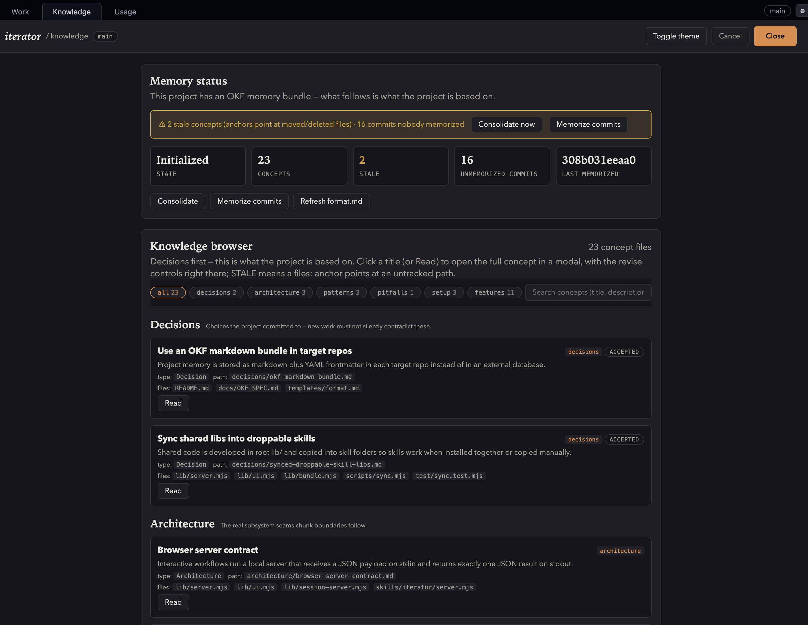

<div align="center">

# iterator

**Iterate on code with AI — one reviewable feature at a time.**

Plan → Features → Red tests → Implement → Review, driven from a browser
dashboard. Every piece of state is plain markdown in an
[Open Knowledge Format (OKF)](docs/OKF_SPEC.md) bundle you can read, edit,
and diff without any tooling.

[The idea](#the-idea) • [The flow](#the-flow) • [The memory bundle](#the-memory-bundle-okf) • [Installation](#installation) • [Configuration](#configuration)

<!-- TODO(image): hub dashboard screenshot — plan header, feature cards with
     status/size/red-green badges, dependency graph, Test/Implement/Review buttons -->


*The `/iterator` hub: the whole plan at a glance — every feature with its
status, size, and 🔴🟢 test badges — and buttons that dispatch each step.*

</div>

---

## The idea

Classical diff tools group changes by file. A developer's mental model is
organized around *what changed and why* — a unit of work usually touches
several files at once. iterator makes the **feature** the primary unit: a
meaningful, vertical slice of implementation (code **and** its tests) of
roughly 200 lines, in dependency order. Review-effectiveness research shows
defect detection degrades past ~200–400 changed lines, so ~200 is a
conservative, reviewable default.

You still lean on AI for planning and implementation — but the unit of change
stays human-reviewable, dependency-ordered, and durable across sessions:

- **The browser UI is the control plane.** One local server renders every
  step's view — dashboard, plan review, feature breakdown, test plan, diff
  review — on one fixed port. No clipboard, no temp files.
- **Everything mechanical is deterministic code, not prompt instructions.**
  `gather.mjs` computes every step's payload (bundle state, parsed git diffs
  mapped to features, test-runner detection); `write.mjs` owns every bundle
  write (frontmatter, timestamps, topological indexes, the update log,
  cycle/reference validation). The model only supplies the semantic text:
  plan prose, feature descriptions, test cases, and the code itself.
- **All persistent state is an [OKF v0.1](docs/OKF_SPEC.md) bundle** in your
  repo's `memory/` directory — self-describing markdown with YAML
  frontmatter. Nothing is locked away in a database or a proprietary format.

Inspired by [Plannotator](https://github.com/backnotprop/plannotator).

## The flow

```
/iterator            dashboard hub — pick a feature, press Test / Implement / Review
      ▼
/iterator-plan       create/revise the plan               → memory/plan.md
      │  (accept auto-continues)
      ▼
/iterator-feature    break the plan into features         → memory/features/<slug>.md
      │
      ├─ (optional) /iterator-test   write RED tests from the feature's contract
      ▼
/iterator-implement  build the dependency-ready wave, drive tests GREEN,
      │              auto-start one review over the wave
      ▼
/iterator-review     feature-vs-git-diff review           → outcome recorded in the feature file
```

### Plan in the browser, not in the scrollback

<!-- TODO(image): plan review screenshot — click-to-edit markdown sections,
     per-section comments, dependency chips -->


`/iterator-plan` turns a goal into a plan you review in the browser:
click-to-edit markdown sections, per-section comments, editable dependency
chips. On accept it writes the `memory/` bundle and auto-continues into the
feature breakdown.

### Features, cut as vertical slices — not files

<!-- TODO(image): feature breakdown screenshot — feature cards, dependency-graph
     visualization, Split/Merge buttons -->


`/iterator-feature` splits the plan into features — one OKF file each — in a
UI with a dependency-graph visualization, snippets, drag-to-move files, and
LLM-backed **Split**/**Merge**. Each feature is a vertical slice: one
user-visible capability including its own tests, implementable and reviewable
on its own.

| Size | Color | Meaning |
| --- | --- | --- |
| small | 🟢 green | One focused change |
| medium | 🟡 yellow | A feature touching a few files |
| large | 🔴 red | Probably two features — should be split |

### Red → green testing

`/iterator-test` is decided by the feature's status: on a **pending** feature
it writes intentionally-failing tests from the feature's contract (red — the
implement step drives them green); on a **done** feature it writes passing
tests against the real code. Either way it commits the tests
(`test(<slug>)`) and records `tests`/`tests_status` in the feature file.

`/iterator-implement` builds the **dependency-ready wave** — every pending
feature whose dependencies are done — with each feature's tests as its
definition of done (implement → run → fix until green, never weakening a
test). On **Accept and commit** each feature is committed separately
(`feature(<slug>)`) and flipped to done, with its commit shas recorded.

### Review the diff the way you think about it

<!-- TODO(image): review screenshot — diff grouped by feature, est-vs-actual
     size, pitfall cards -->


`/iterator-review` shows the git diff grouped **by feature**, not by file,
with est-vs-actual line counts and amber cards for known pitfalls matched to
the touched files. It warns when a feature's actual diff exceeds ~200 changed
code lines — reviewability enforced where it can actually be measured. Done
features are reviewable too: the diff is rebuilt from the feature's recorded
commits.

### Knowledge that flows back in

<!-- TODO(image): knowledge view screenshot — area cards, concepts with
     anchors and stale flags, memorize status -->


The same bundle carries **knowledge areas** (`architecture/`, `decisions/`,
`patterns/`, `pitfalls/`, `setup/`). Knowledge is not write-only: pitfalls
resurface as cards during review, architecture notes feed the feature
breakdown, and relevant memories are injected into implementation.

- **`/iterator-knowledge`** — the Knowledge view: area cards, every concept
  with its `files:` anchors and stale flag, memorize status.
- **`/iterator-init`** — analyze the repo and draft the initial memories per
  area, reviewed in the browser before anything is written.
- **`/iterator-consolidate`** — re-review existing memories against the
  current code: stale anchors, dead concepts, merges.
- **`/iterator-memorize`** — study commits made outside the iterator flow and
  draft create/update/delete cards, with conflict detection.

Knowledge also flows automatically: when `/iterator-implement` lands a wave,
the accepted diff is evaluated for durable knowledge, and proposed memory
creates/updates appear as reviewable cards in the same commit review — with
an explicit Apply/Skip toggle before anything is written.

## The memory bundle (OKF)

All state lives in a `memory/` directory in your project root — a
self-describing [Open Knowledge Format (OKF) v0.1](docs/OKF_SPEC.md) bundle,
plain markdown with YAML frontmatter:

```
memory/
├── index.md          # bundle root index (okf_version)
├── format.md         # the metadata schema, copied into every bundle
├── plan.md           # the plan (type: Plan)
├── design.md         # optional — the project's design params (type: Design)
├── log.md            # chronological history of what the AI did
├── features/
│   ├── index.md      # feature listing with status
│   └── <slug>.md     # one document per feature (type: Feature)
└── architecture/ decisions/ patterns/ pitfalls/ setup/
                      # knowledge areas (one concept per file)
```

An example feature document:

```markdown
---
type: Feature
title: Auth middleware
description: JWT-based auth middleware for all protected routes.
status: pending
size: small
depends_on: [config-module]
files: ["src/auth.ts", "src/middleware/*.ts"]
tests: ["test/auth.test.ts"]
tests_status: red
---

# Implementation notes
Verify the token from the config secret; wrap protected routes.

# Blast radius
Every route behind the auth guard.
```

The feature **slug** (the filename without `.md`) is the feature's identity:
its OKF concept ID, its `depends_on` key, and its commit-message name. One
file per feature means per-feature git history and no fragile line-number
indexes. The full schema is in [`templates/format.md`](templates/format.md);
the format itself is specified in [`docs/OKF_SPEC.md`](docs/OKF_SPEC.md).

## Installation

iterator currently supports two harnesses: **pi** (the full experience) and
**Claude Code** (everything except the pi-only runtime features).

### pi

Install the repo as a pi package — the manifest in `package.json` points at
`skills/` and `extensions/`, so the install registers the `/iterator…`
commands and the pi extension runtime:

```bash
pi install git:github.com/<user>/iterator@<tag>   # or: pi -e … for one session
```

The pi extension unlocks the full feature set: **auto mode** (test →
implement → review driven automatically, with a reviewer agent standing in
for you), **per-role models & thinking** (planner/implementer/tester/reviewer
each pin a model and thinking level), **live pause** (aborting the in-flight
stream), a session dashboard with Work | Knowledge tabs, and **token capture**
into the usage ledger.

For running iterator inside a Docker sandbox, use
[pi-docker-sandbox-setup](https://github.com/Christoph/pi-docker-sandbox-setup):
a pi sandbox image that installs iterator, sets `ITERATOR_REMOTE=1`, and
forwards port 7777 to the host via its `pisbx` script — open the printed URL
in the host browser and everything works as if local.

### Claude Code

Load the plugin for a session with `--plugin-dir`:

```bash
claude --plugin-dir /path/to/iterator
```

To install it persistently, add the directory as a local marketplace and
install from it (inside Claude Code):

```
/plugin marketplace add /path/to/iterator
/plugin install iterator
```

All skills (`/iterator` + the six `/iterator-*` steps + the four knowledge
skills) are auto-discovered from `skills/*/SKILL.md`.

In Claude Code, iterator runs in Agent-Skills mode — a reduced feature set:
the guided flow, all browser UIs, red/green testing, settings storage, the
review guards, archive browsing, and the Usage view all work unchanged; the
**pi-only** features (auto mode, per-role model/thinking switching, live
pause, token capture) are stored in settings but inert.

## Requirements

- Node.js ≥ 18 (the servers use only Node built-ins — no `npm install` needed)
- pi or Claude Code
- A git repository (the `memory/` bundle is resolved relative to the git root)

## Project settings

Per-project behavior lives in `memory/settings.md`, edited from the dashboard
(gear icon, or `/iterator-settings` in pi) and written only by the
deterministic writer:

- **auto mode** *(pi)* — after the feature set is approved, the driver runs
  test → implement → review automatically; a reviewer agent's verdicts are
  recorded in each feature's `# Review` history, and after
  `max_review_iterations` needs-work rounds it pauses and escalates to you.
- **per-role models & thinking** *(pi)* — planner/implementer/tester/reviewer
  can each pin a model and thinking level.
- **git flow** — `branch_per_plan` creates `iterator/<plan-slug>` on plan
  approval, in a separate **git worktree** by default;
  `block_commit_on_leftovers` refuses accept-commit while changed files are
  neither assigned to a feature nor explicitly skipped.
- **token ledger** — `usage_ledger` records per-step × per-model token counts
  into `memory/usage.md` (the Usage tab).

## Configuration

Every interactive step runs through one tiny local HTTP server bound to
`127.0.0.1` that opens a browser UI and prints your response back to the
agent. The port defaults to **7777** (`ITERATOR_PORT` overrides) and is
**stable by design**: a lingering iterator server from an earlier run is shut
down and replaced, so back-to-back runs never drift to 7778.

- `ITERATOR_PORT` — fixed port (default 7777)
- `ITERATOR_MEMORY_DIR` — relocate the bundle (relative to the git root)
- `ITERATOR_NO_OPEN=1` — print the URL without opening a browser
- `ITERATOR_REMOTE=1` — force remote mode (see below)

The server rejects requests with a non-localhost `Host` header (DNS-rebinding
protection). Reloading the tab is safe — only closing it cancels.

### Remote sessions: SSH, Docker, devcontainers

When the agent runs inside a container or SSH session but your browser is on
the host, the server detects it (SSH/container markers, or explicit
`ITERATOR_REMOTE=1`) and switches to remote mode: binds `0.0.0.0` (override
with `ITERATOR_BIND_HOST`), skips the browser opener, and prints a
`http://127.0.0.1:<port>/` URL to open on the host. The sandbox must publish
the port:

```bash
sbx ports <sandbox> --publish 7777:7777   # Docker sandboxes (explicit host:container)
docker run -p 127.0.0.1:7777:7777 …       # plain Docker — keep the host side on loopback
ssh -L 7777:localhost:7777 host           # plain SSH
```

MicroVM sandboxes have no container marker files, so set `ITERATOR_REMOTE=1`
in the sandbox image (pi-docker-sandbox-setup's image already does). Binding
`0.0.0.0` exposes the UI to whatever network the sandbox is attached to —
keep the host-side publish on loopback.

## How it works

1. A skill pipes a JSON payload to `skills/iterator/server.mjs` — usually the
   one-command form `{"gather":true,"step":"<step>", …}`. Nothing is written
   to `/tmp`.
2. The server shuts down any lingering iterator server, binds the fixed port,
   serves a self-contained page (data embedded inline and safely escaped),
   and opens `http://127.0.0.1:<port>/`.
3. On submit the browser POSTs structured JSON to `/submit`; the server
   prints it to stdout and exits. Closing the tab cancels cleanly; a 2h idle
   times out.
4. The agent reads stdout, updates the `memory/` bundle through `write.mjs`,
   and re-runs the server for the next round.

See [docs/ARCHITECTURE.md](docs/ARCHITECTURE.md) for the full design and
[docs/OKF_SPEC.md](docs/OKF_SPEC.md) for the bundle format.

## License

MIT
